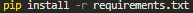
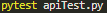
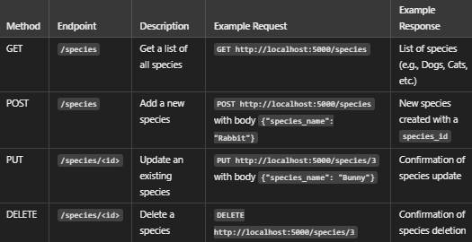

# Animal Shelter API

## Description

A Flask-based REST API for managing pets, species, adoptions, and medical records in an animal shelter database.

## Installation

To install the required dependencies, run:

## Configuration

To configure the database:

    1. Upload the animal_shelter MySQL database to your server or local machine. 
    2. Update the database configuration in the Flask app with your database connection details.

Environment variables needed:

    > MYSQL_HOST: The host for the MySQL database (e.g., localhost or the IP address of the database server).
    > MYSQL_USER: MySQL username (e.g., root).
    > MYSQL_PASSWORD: MySQL password (e.g., root).
    > MYSQL_DB: Name of the database (e.g., animal_shelter).
    > SECRET_KEY = "vincent7"

## API Endpoints

| Endpoint                     | Method | Description                   |
|------------------------------|--------|-------------------------------|
| `/`                          | GET    | Home/Index page               |
| `/species`                   | GET    | List all species              |
| `/species`                   | POST   | Add a new species             |
| `/species/<species_id>`      | PUT    | Update a species              |
| `/species/<species_id>`      | DELETE | Delete a species              |
| `/pets`                      | GET    | List all pets                 |
| `/pets`                      | POST   | Add a new pet                 |
| `/pets/<pet_id>`             | PUT    | Update a pet                  |
| `/pets/<pet_id>`             | DELETE | Delete a pet                  |
| `/adoptions`                 | GET    | List all adoptions            |
| `/adoptions`                 | POST   | Add a new adoption            |
| `/adoptions/<adoption_id>`   | DELETE | Delete an adoption            |
| `/medical_records`           | GET    | List all medical records      |
| `/medical_records`           | POST   | Add a new medical record      |
| `/medical_records/<treatment_id>` | PUT    | Update a medical record       |
| `/medical_records/<treatment_id>` | DELETE | Delete a medical record       |

## Testing

To run the tests, ensure pytest and pytest-flask are installed, then run:

## Example Usage

## Git Commit Guidelines

Use conventional commits for clarity:

    > feat: add a new feature (e.g., feat: add species CRUD operations)
    > fix: resolve a bug or issue (e.g., fix: correct species retrieval error)
    > docs: update documentation (e.g., docs: update API documentation)
    > test: add or update tests (e.g., test: add mock tests for pet CRUD operations)
    > build: creating new file (e.g., build: initial files)

